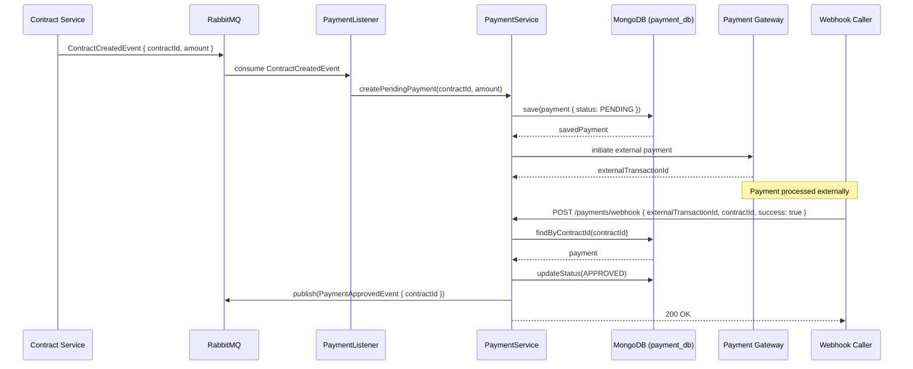
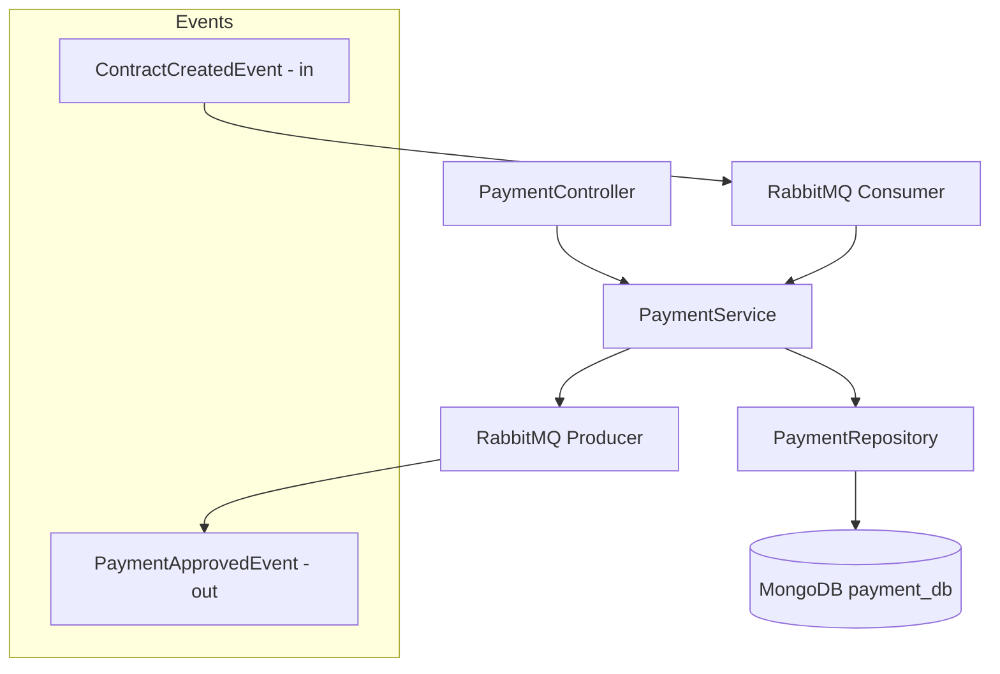

# 💰 Payment Service

Microservice responsible for processing financial transactions in the Clean Pro Solutions platform. Participates in the payment SAGA: consumes `ContractCreatedEvent`, creates a pending payment, and upon webhook confirmation emits `PaymentApprovedEvent`.

---

## 📋 Service Info

| Property     | Value                                                                       |
|--------------|-----------------------------------------------------------------------------|
| Port         | `8087`                                                                      |
| Database     | MongoDB — `payment_db`                                                      |
| RabbitMQ     | Producer (`PaymentApprovedEvent`) + Consumer (`ContractCreatedEvent`)       |
| Registry     | Eureka (`payment-service`)                                                  |

---

## 🔄 Main Flow — SAGA Sequence Diagram



---

## 🏗️ Internal Architecture



---

## 📡 API Endpoints

| Method | Path                            | Request Body                                              | Response           |
|--------|---------------------------------|-----------------------------------------------------------|--------------------|
| GET    | `/payments/contract/{contractId}` | —                                                       | `200 PaymentResponse` |
| POST   | `/payments/webhook`             | `{ externalTransactionId, contractId, success: boolean }` | `200 OK`           |

---

## ⚙️ Environment Variables

| Variable                    | Description              | Default                                      |
|-----------------------------|--------------------------|----------------------------------------------|
| `SPRING_DATA_MONGODB_URI`   | MongoDB connection URI   | `mongodb://localhost:27017/payment_db`       |
| `RABBITMQ_HOST`             | RabbitMQ host            | `localhost`                                  |
| `RABBITMQ_PORT`             | RabbitMQ port            | `5672`                                       |
| `EUREKA_SERVER_URL`         | Eureka registry URL      | `http://localhost:8761/eureka`               |

---

## 🚀 Build & Run

### Build
```bash
mvn clean install
```

### Run locally
```bash
mvn spring-boot:run
```

### Run with Docker Compose
```bash
docker-compose up payment-service
```

---

## 🧪 How to Test

### Simulate payment webhook (success)
```bash
curl -X POST http://localhost:8087/payments/webhook \
  -H "Content-Type: application/json" \
  -d '{
    "externalTransactionId": "txn_abc123",
    "contractId": "64a1b2c3d4e5f6a7b8c9d0e5",
    "success": true
  }'
```

### Simulate payment webhook (failure)
```bash
curl -X POST http://localhost:8087/payments/webhook \
  -H "Content-Type: application/json" \
  -d '{
    "externalTransactionId": "txn_xyz789",
    "contractId": "64a1b2c3d4e5f6a7b8c9d0e5",
    "success": false
  }'
```

### Get payment by contract
```bash
curl http://localhost:8087/payments/contract/64a1b2c3d4e5f6a7b8c9d0e5
```

---

## 🗂️ Project Structure

```
clean-pro-solutions-payment-service/
├── src/main/java/
│   └── com/cleanpro/payment/
│       ├── controller/     # REST endpoints (webhook)
│       ├── service/        # Payment processing logic
│       ├── repository/     # MongoDB repositories
│       ├── dto/            # Request/Response records
│       ├── model/          # Payment entity & PaymentStatus enum
│       ├── config/         # RabbitMQ config
│       └── exception/      # Custom exceptions
├── src/test/
└── pom.xml
```

---

© 2026 Clean Pro Solutions — Developed by **Emerson Lima**
